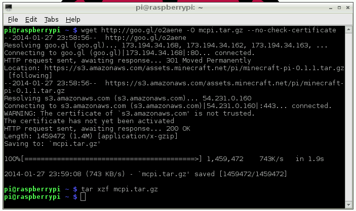

# Getting Started with Programming the Minecraft World

Minecraft is a popular sandbox open world building game. A free version of Minecraft is available for the Raspberry Pi; it is the only edition of the game with a programming interface. This means you can write commands and scripts in Python code, to build things in the game automatically as well as manually.


With Raspberry Pi you are able to write programs that take effect in the world of Minecraft! Learn to create a program to post a message to the chat screen, locate your player in a world, and have that player drop flowers when they walk on grass.

## Requirements

There are no extra requirements for using Minecraft on the Raspberry Pi with a Raspbian SD card.

However, as Minecraft is not currently installed by default in Raspbian, you'll need to download the files from the web and install it.

## Download & Install Minecraft Pi

Open a terminal window and type the following command:

```bash
wget http://goo.gl/o2aene -O mcpi.tar.gz --no-check-certificate
```

You'll see some information about the downloading file, like so:



Once you see `'mcpi.tar.gz' saved` and are returned to the prompt, type:

```bash
tar xzf mcpi.tar.gz
```

to extract the files. This will create a new directory in your home folder called `mcpi`, which is where the Minecraft installation lives.

It is safe to delete the `mcpi.tar.gz` file once you have extracted its contents. To do this, enter `rm mcpi.tar.gz`.

## Run Minecraft

To run Minecraft type:

```bash
cd mcpi
./minecraft-pi
```

When Minecraft Pi has loaded, click on **Start Game**, followed by **Create new**.

## Programming interface

With Minecraft running, you can execute Python code to interact with the Minecraft world you have running. To do this you can open IDLE in a window alongside the Minecraft window.

## Steps

1. Post a message to Minecraft Pi
1. Finding a Player's Location
1. Drop Flower Blocks

## The worksheet

- [The worksheet](worksheet.md)

## Licence

Unless otherwise specified, everything in this repository is covered by the following licence:

[](http://creativecommons.org/licenses/by-sa/4.0/)

***Minecraft Pi*** by the [Raspberry Pi Foundation](http://www.raspberrypi.org) is licenced under a [Creative Commons Attribution 4.0 International Licence](http://creativecommons.org/licenses/by-sa/4.0/).

Based on a work at https://github.com/raspberrypilearning/minecraft-pi
