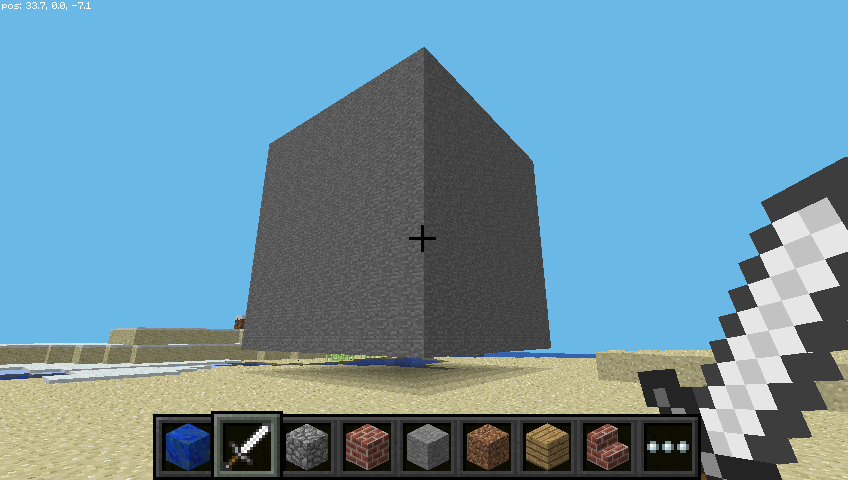

## Utiliser l'interface de programmation Python

### Liste de contrôle d'activité

+ Avec Minecraft Pi lancé et un monde créé, appuyez sur `Tab` pour libérer la souris et accéder au bureau du Raspberry Pi. Lancez Python 3 (IDLE) à partir du menu et déplacez la fenêtre pour qu'elle soit côte-à-côte avec celle de Minecraft Pi.

Vous pouvez soit saisir les commandez directement dans la fenêtre de Python ou bien créer un fichier séparé que vous pourrez sauvegarder et ré-exécuter à nouveau plus tard. Si vous voulez créer un fichier, cliquez `File > New file` puis `File > Save` dans la nouvelle fenêtre.

+ Commencez par importer la librarie Minecraft Pi, créer une connection avec le jeu et la tester en affichant un message "Bonjour monde Minecraft" à l'écran.
```Python
    from mcpi.minecraft import Minecraft

    mc = Minecraft.create()

    mc.postToChat("Bonjour monde Minecraft!")
```

Si vous entrez les commandes dans la fenêtre Python, pressez Entrée (Enter) après chaque ligne. Si vous utilisez un fichier, sauvegardez le d'abord avec `Ctrl + s` puis exécutez le avec `F5`. Lorsque votre code s'exécute, vous devriez voir votre message s'afficher dans la fenêtre du jeu.


### Trouvez votre position

### Liste de contrôle d'activité 

+ Pour trouver votre position, tapez:
```Python
    pos = mc.player.getPos()
```

`pos` contient maintenant votre position. Accédez chacune des coordonnées avec `pos.x`, `pos.y` et `pos.z`.

+ Alternativement, vous pouvez assigner les coordonnées à des variables indépendantes en utilisant la technique de décompression de Python:
```Python
    x, y, z, = mc.player.getPos()
```

`x`, `y` et `z` contiennent maintenant chacune une partie des coordonnées de votre position. `x` et `z` sont les directions horizontales (avant/arrière et gauche/droite) et `y` est la direction verticale (haut/bas).

Notez que la fonction `getPos()` retourne la position du joueur au moment où elle est appelée. Si vous changez votre position, vous devrez appeler la fonction à nouveau ou bien utiliser la position stockée dans `pos` ou dans `x`, `y` et `z`.

### Téléportation 

### Liste de contrôle d'activité 

+ En plus de trouver votre position, vous pouvez spécifier une position particulière où vous téléporter.
```Python
    x, y, x = mc.player.getPos()
    mc.player.setPos(x, y+100, z)
```

Ceci déplacera votre joueur à une hauteur de 100 blocs dans les airs. Cela veut dire que vous vous téléporterez au milieu du ciel et retomberez là où vous étiez.

+ Essayez de vous téléporter ailleurs!

### Placer des blocs

### Liste de contrôle d'activité

+ Vous pouvez placer un bloc unique à des coordonnées spécifiques avec la fonction `mc.setBlock()`:
```Python
    x, y, z = mc.player.getPos()
    mc.setBlock(x+1, y, z, 1)
```

Un bloc de pierre devrait apparaître à côté de là où vous vous trouvez. S'il n'est pas directement devant vous, il peut être à côté ou derrière vous. Retournez à la fenêtre Minecraft et utilisez la souris pour tourner sur place jusqu'à-ce que vous voyez un bloc gris directement devant vous.


Les arguments passés à la fonction `setBlock` sont `x`, `y`, `z` et `id`. `(x, y, z)` correspond à la position dans le monde (nous avons spécifié un bloc à côté de la position du joueur avec `x + 1`) et `id` correspond au type de bloc à placer. `1` correspond à de la pierre ("STONE").

+ Vous pouvez essayer les blocs suivants:
```
    Air ("AIR"):         0
    Gazon ("GRASS"):     2
    Poussière ("DIRT") : 3
```

+ Maintenant, avec le bloc en vue, essayez de le changer en d'autre chose:
```python
    mc.setBlock(x+1, y, z, 3)
```

Vous devriez voir le bloc de pierre gris changer devant vos yeux!


### Constantes de blocs 

### Liste de contrôle d'activité 

+ Vous pouvez utiliser des constantes prédéfinies pour spécifier vos types de blocs si vous connaissez leurs noms (en Anglais). Pour ce faire, vous devrez ajouter une autre ligne `import`:
```Python
    from mcpi import block
```

+ Vous pouvez maintenant écrire le code suivant pour placer un bloc:
```Python
    mc.setBlock(x+3, y, z, block.STONE.id)
```

Les noms des constantes de blocs sont assez faciles à deviner si vous connaissez leur nom Anglais. Dans la majorité des cas, utilisez simplement des MAJUSCULES. Voici quelques noms particuliers que vous pouvez apprendre (essayez-les):

```
    WOOD_PLANKS
    WATER_STATIONARY
    GOLD_ORE
    GOLD_BLOCK
    DIAMOND_BLOCK
    NETHER_REACTOR_CORE
```

### Des blocs comme variables 

### Liste de contrôle d'activité 

+ Si vous connaissez l'`id` d'un bloc, il peut être utile de le définir comme une variable. Vous pouvez utiliser le nom de constante ou bien l'`id`:

```Python
    dirt = 3
    mc.setBlock(x, y, z, dirt)
```
ou

```Python
    dirt = block.DIRT.id
    mc.setBlock(x, y, z, dirt)
```

### Blocs spéciaux 

### Liste de contrôle d'activité 

+ Certains blocs ont des propriétés additionnelles, tel que la laine ("WOOL") qui a un paramètre permettant d'en spécifier la couleur. Pour la régler, utilisez le quatrième paramètre optionel de la fonction `setBlock`:
```Python
    wool = 35
    mc.setBlock(x, y, z, wool, 1)
```

Ici, le quatrième paramètre `1` règle la couleur à orange. Sans le quatrième paramètre, elle est réglée à la valeur par défaut `0` qui correspond à blanc. D'autres couleurs disponibles sont:
```
    2: Magenta
    3: Bleu pâle
    4: Jaune
```

+ Essayez d'autre numéros de couleurs et regardez la couleur du bloc changer!

D'autre blocs qui ont des propriétés additionnelles sont le bois ("WOOD", `17`): 'oak', 'spruce', 'birch', etc., le gazon long ("GRASS_TALL", `31`): 'shrub', 'grass', 'fern', etc., la torche ("TORCH", `50`): 'pointing east, west, north, south' et d'autres. Voir la [référence d'API](https://github.com/DrGFreeman/Minecraft-Pi-API-Reference-FR) pour tous les détails.

### Placer plusieurs blocs 

### Liste de contrôle d'activité 

+ En plus de pouvoir placer des blocs individuels avec `setBlock`, vous pouvez remplir un volume en une seule commande avec `setBlocks`:
```Python
    stone = 1
    x, y, z = mc.player.getPos()
    mc.setBlocks(x+1, y+1, z+1, x+11, y+11, z+11, stone)
```

Ceci remplira un cube de 10 x 10 x 10 blocs de pierre.



Vous pouvez remplir de plus grands volumes avec la fonction `setBlocks` mais il faudra plus de temps pour les générer.