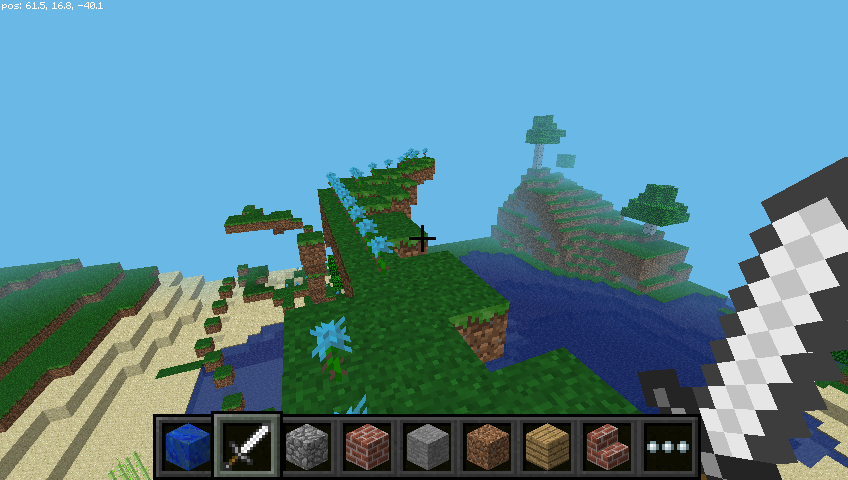

## Placer des blocs en marchant

### Liste de contrôle d'activité 

Maintenant que vous savez comment placer des blocs, utilisons votre position en mouvement pour placer des blocs lorsque vous vous déplacez.

+ Le code suivant placera une fleure derrière vous partout où vous irez:
```Python
    from mcpi.minecraft import Minecraft
    from time import sleep

    mc = Minecract.create()

    fleur = 38

    while True:
        x, y, z = mc.player.getPos()
        mc.setBlock(x, y, z, fleur)
        sleep(0.1)
```

+ Maintenant, marchez un certain temps puis tournez vous pour voir les fleurs que vous avez placées derrière vous.


Puisque nous avons utilisé une boucle `while True`, celle-ci continuera indéfiniment. Pour l'arrêter, faites `Ctrl + c` dans la fenêtre Python.

+ Essayez de vous déplacer dans les airs et regardez les fleurs que vous laissez dans le ciel:


+ Que faire si on ne voulait placer des fleurs que si le joueur est sur du gazon? Nous pouvons utiliser `getBlock` pour trouver de quoi est fait un bloc à une position donnée.
```Python
    x, y, z = mc.player.getPos()  # Position du joueur (x, y, z)
    ce_bloc = mc.getBlock(x, y, z)  # id du bloc
    print(ce_bloc)
```

Ceci nous indique l'`id` du bloc à la position _où_ le joueur se trouve (il s'agira de `0`, c'est à dire un bloc d'air). Nous voulons connaître le type de bloc _sur lequel_ le joueur se tient Pour ce faire, nous soustrayons 1 à la valeur `y` et utilisons `getBlock` pour déterminer le l'`id` du bloc sur lequel nous nous trouvons:
```Python
    x, y, z = mc.player.getPos()  # Position du joueur (x, y, z)
    bloc_dessous = mc.getBlock(x, y-1, z)  # id du bloc
    print(bloc_dessous)
```

+ Testez le un exécutant une boucle qui imprime l'`id` du bloc sur lequel le joueur se tient.
```Python
    while True:
        x, y, z = mc.player.getPos()  # Position du joueur (x, y, z)
        bloc_dessous = mc.getBlock(x, y-1, z)  # id du bloc
        print(bloc_dessous)
```


+ Nous pouvons utiliser une condition `if` pour choisir si nous voulons placer une fleur ou non:
```Python
    gazon = 2
    fleur = 38

    while True:
        x, y, z = mc.player.getPos()  # Position du joueur (x, y, z)
        bloc_dessous = mc.getBlock(x, y-1, z)  # id du bloc

        if bloc dessous == gazon:
          mc.setBlock(x, y, z, fleur)
        sleep(0.1)
```

+ Peut-être voudriez vous changer le bloc sur lequel le joueur se tient en gazon s'il n'en est pas déjà? :
```Python
    if bloc_dessous == gazon:
      mc.setBlock(x, y, z, fleur)
    else:
      mc.setBlock(x, y-1, z, gazon)
```

Maintenant nous pouvons marcher et si nous marchons sur du gazon, nous y plaçons une fleur. Si le bloc n'est pas du gazon, nous le changeons en gazon. Lorsque nous nous tournons et rebroussons chemin, nous laissons maintenant une fleur derrière nous.

