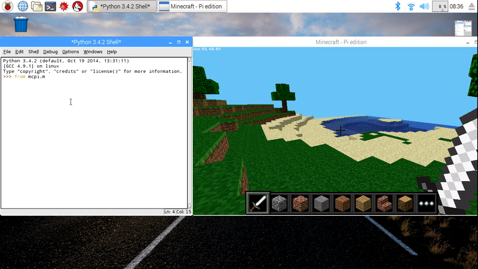

## Použite rozhranie programovania Python

Spustenie Minecraft a vytvorenie sveta prinesie vašu pozornosť od hry stlačením klávesu `Tab` , ktorý vám uvoľní myš. Otvorte program Python 3 z ponuky aplikácie a presuňte okná tak, aby boli vedľa seba.

Môžete buď zadávať príkazy priamo do okna Pythonu alebo vytvoriť súbor, aby ste mohli uložiť kód a spustiť ho znova inokedy.

Ak chcete vytvoriť súbor, prejdite na `Súbor > Nové okno` a `Súbor > Uložiť`. Pravdepodobne budete chcieť uložiť to vo vašom domovskom priečinku alebo v novom priečinku projektu.

Začnite tým, že importujete knižnicu Minecraft, vytvoríte pripojenie k hre a testujete ju odoslaním správy "Hello world" na obrazovku:

```python
from mcpi.minecraft import Minecraft

mc = Minecraft.create()

mc.postToChat("Hello world")
```

Ak zadávate príkazy priamo do okna Pythonu, stlačte `Po každom riadku zadajte`. Ak je to súbor, uložte s `Ctrl + S` a spustite s `F5`. Po spustení kódu by ste mali vidieť svoju správu na obrazovke v hre.



### Zistite svoju polohu

Ak chcete nájsť svoju polohu, napíšte:

```python
pos = mc.player.getPos()
```

`pos` teraz obsahuje vaše miesto; prístup ku každej časti súboru súradníc s `poz. x`, `pos.y` a `poz.`.

Alternatívne je pekný spôsob, ako dostať súradnice do samostatných premenných, pomocou technológie rozbaľovania Pythonu:

```python
x, y, z = mc.player.getPos()
```

Teraz `x`, `y`a `z` obsahujú každú časť vašich súradníc polohy. `x` a `z` sú smerovanie chôdze (dopredu / dozadu a doľava / doprava) a `y` je hore / dole.

Všimnite si, že `getPos ()` vracia miesto prehrávača v danom čase, a ak presuniete pozíciu, musíte znovu zavolať funkciu alebo použiť uložené miesto.

### Teleport

Okrem zistenia vašej aktuálnej polohy môžete určiť konkrétne miesto na teleportovanie.

```python
x, y, z = mc.player.getPos()
mc.player.setPos(x, y+100, z)
```

Tento prehrávač prenesiete do 100 miest vo vzduchu. To znamená, že teleportujete do stredu oblohy a spadnete rovno späť na miesto, kde ste začali.

Skúste teleportovať niekde inde!

### Nastavte blok

Môžete umiestniť jeden blok na danú súpravu súradníc s `mc.setBlock ()`:

```python
x, y, z = mc.player.getPos()
mc.setBlock(x+1, y, z, 1)
```

Teraz by sa mal objaviť kamenný blok vedľa miesta, kde stojíte. Ak to nie je hneď pred tebou, môže to byť vedľa teba alebo za tebou. Vráťte sa do okna Minecraft a pomocou myši otočte sa na mieste, kým neuvidíte šedý blok priamo pred vami.


Argumenty odovzdané `set bloku` sú `x`, `r`, `z` a `číslo`. `(x, y, z)` vzťahuje na pozíciu na svete (určili sme jeden blok od miesta, kde hráč stojí `x + 1`) a `id` týka typu bloku, ktorý by sme rád umiestniť. `1` je kameň.

Ďalšie bloky si môžete vyskúšať:

    Air:   0
    Grass: 2
    Dirt:  3
    

Teraz s blokom v očiach skúste zmeniť ho na niečo iné:

```python
mc.setBlock(x+1, y, z, 2)
```

Mali by ste vidieť zmenu sivého kamenného bloku pred tvojimi očami!


#### Blokové konštanty

Môžete použiť vstavané blokové konštanty na nastavenie blokov, ak poznáte ich názvy. Budete potrebovať ďalšie `import` riadok prvej hoci.

```python
from mcpi import block
```

Teraz môžete napísať nasledovné a umiestniť blok:

```python
mc.setBlock(x+3, y, z, block.STONE.id)
```

Bloky ids sú docela ľahké uhádnuť, stačí použiť ALL CAPS, ale tu je niekoľko príkladov, ako si zvyknúť na spôsob, akým sú pomenované.

    WOOD_PLANKS
    WATER_STATIONARY
    GOLD_ORE
    GOLD_BLOCK
    DIAMOND_BLOCK
    NETHER_REACTOR_CORE
    

### Blok ako premenná

Ak poznáte id bloku, môže byť užitočné nastaviť ho ako premennú. Môžete použiť meno alebo celé číslo id.

```python
dirt = 3
mc.setBlock(x, y, z, dirt)
```

alebo

```python
dirt = block.DIRT.id
mc.setBlock(x, y, z, dirt)
```

### Špeciálne bloky

Existujú niektoré bloky, ktoré majú ďalšie vlastnosti, napríklad Vlna, ktorá má nastavenie navyše, môžete určiť farbu. Ak chcete nastaviť toto použitie, voliteľný štvrtý parameter v `setBlock`:

```python
wool = 35
mc.setBlock(x, y, z, wool, 1)
```

Tu štvrtý parameter `1` nastaví farbu vlny na oranžovú. Bez štvrtého parametra je nastavená na predvolenú hodnotu (`0`), ktorá je biela. Niektoré ďalšie farby sú:

    2: Magenta
    3: Light Blue
    4: Yellow
    

Skúste ešte viac čísel a sledujte zmenu bloku!

Ďalšie bloky, ktoré majú ďalšie vlastnosti, sú drevo (`17`): dub, smrek, breza atď .; vysoká tráva (`31`): ker, tráva, papraď; baterka (`50`): smerujúca na východ, západ, sever, juh; a viac. Viac informácií nájdete v referenčnom dokumente [API](http://www.stuffaboutcode.com/p/minecraft-api-reference.html).

### Nastaviť viac blokov

Rovnako ako nastavenie jedného bloku s `setBlock` môžete vyplniť objem priestoru v jednom kroku s `setBlocks`:

```python
stone = 1
x, y, z = mc.player.getPos()
mc.setBlocks(x+1, y+1, z+1, x+11, y+11, z+11, stone)
```

Tým sa vyplní 10 x 10 x 10 kocka pevného kameňa.


Môžete vytvoriť väčšie zväzky s funkciou `setBlocks` ale generovanie môže trvať dlhšie!