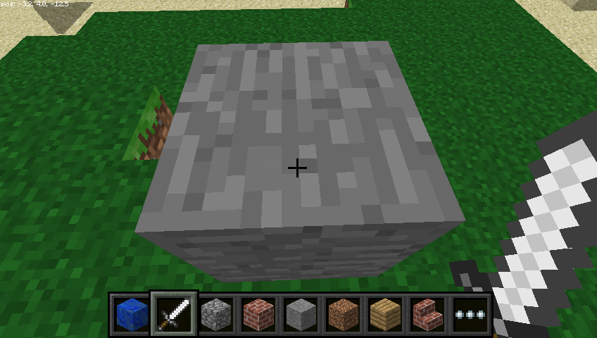

## Použite rozhranie programovacieho jazyka Python

Keď je Minecraft spustený a svet je vytvorený, odísť z hry môžete stlačením klávesu `Tab`, ktorý vám uvoľní myš. Z ponuky aplikácií otvorte Python 3 a usporiadajte okná tak, aby boli vedľa seba.

Príkazy môžete zadávať priamo do okna Python-u alebo si môžete vytvoriť súbor, aby ste mohli svoj kód uložiť a znova spustiť neskôr.

Ak chcete vytvoriť súbor, prejdite na `File > New window` a `File > Save`. Pravdepodobne ho budete chcieť uložiť vo vašom domovskom priečinku alebo v novom priečinku pre projekty.

Začnite tým, že importujete knižnicu Minecraft, vytvoríte spojenie s hrou a otestujete ho odoslaním správy "Hello world" na obrazovku:

```python
from mcpi.minecraft import Minecraft

mc = Minecraft.create()

mc.postToChat("Hello world")
```

Ak zadávate príkazy priamo do okna Pythonu, stlačte `Enter` po každom riadku. Ak píšete do súboru, uložíte ho stlačením `Ctrl + S` a spustíte s `F5`. Keď spustíte váš kód, mali by ste vidieť vašu správu v hre na obrazovke.


### Zistite svoju polohu

Ak chcete zistiť svoju polohu, napíšte:

```python
pos = mc.player.getPos()
```

`pos` teraz obsahuje vašu pozíciu; získať pristup ku každej časti z množiny súradníc môžete cez `pos.x`, `pos.y` a `pos.z`.

Ďalší pekný spôsob, ako sa k súradniciam dostať cez samostatné premenné, je použiť techniku rozbaľovania jazyka Python:

```python
x, y, z = mc.player.getPos()
```

Premenné `x`, `y`a `z` teraz obsahujú každú súradnicu vašej polohy. `x` a `z` sú súradnice určujúce smer chôdze (dopredu/dozadu a doľava/doprava) a `y` je pre smer hore/dole.

Všimnite si, že `getPos()` vracia miesto hráča v danom čase a ak ho presuniete, musíte funkciu zavolať znovu alebo použiť uloženú lokáciu.

### Teleport

Podobne, ako zistenie vašaj aktuálnej polohy, môžete určiť konkrétne miesto, na ktoré sa chcete teleportovať.

```python
x, y, z = mc.player.getPos()
mc.player.setPos(x, y+100, z)
```

Týmto sa váš hráč presunie o 100 pozícií do vzduchu. To znamená, že sa teleportujete do stredu oblohy a okamžite začnete padať späť na miesto, kde ste začali.

Skúste sa teleportovať niekde inde!

### Vytvorenie bloku

Jeden blok môžete umiestniť na zvolené súradníce zavolaním `mc.setBlock()`:

```python
x, y, z = mc.player.getPos()
mc.setBlock(x+1, y, z, 1)
```

Vedľa miesta, kde stojíte, by sa mal objaviť blok kameňa. Ak nie je hneď pred vami, môže byť vedľa vás alebo za vami. Vráťte sa do okna aplikácie Minecraft a pomocou myši sa otáčajte dookola, až pokiaľ neuvidíte šedý blok priamo pred sebou.



Argumenty odovzdané funkcii `set block` sú `x`, `y`, `z` a `id`. `(x, y, z)` určujú polohu vo svete (určili sme jeden blok vedľa od miesta, kde hráč stojí pomocou `x + 1`) a `id` špecifikuje typ bloku, ktorý by sme chceli umiestniť. `1` je kameň.

Môžete si vyskúšať aj ďalšie bloky:

    Vzduch:   0
    Tráva: 2
    Špina:  3
    

S blokom pred vašimi očami, skúste ho zmeniť na niečo iné:

```python
mc.setBlock(x+1, y, z, 2)
```

Pred vašimi očami by ste mali vidieť zmenu sivého kamenného bloku!


#### Konštanty blokov

Môžete použiť vstavané konštanty blokov na vytvorenie vašich blokov, ak poznáte ich názvy. Na to budete potrebovať ďalší riadok s príkazom `import`.

```python
from mcpi import block
```

Teraz môžete vytvárať bloky takto:

```python
mc.setBlock(x+3, y, z, block.STONE.id)
```

Identifikátory blokov sa dajú uhádnuť celkom ľahko, stačí používať VEĽKÉ PÍSMENÁ. Tu je niekoľko príkladov, ktoré vám pomôžu zvyknúť si na spôsob, akým sú pomenované.

    WOOD_PLANKS
    WATER_STATIONARY
    GOLD_ORE
    GOLD_BLOCK
    DIAMOND_BLOCK
    NETHER_REACTOR_CORE
    

### Blok ako premenná

Ak poznáte id bloku, môže byť užitočné nastaviť ho ako premennú. Môžete použiť jeho názov alebo jeho číselný identifikátor.

```python
dirt = 3
mc.setBlock(x, y, z, dirt)
```

alebo

```python
dirt = block.DIRT.id
mc.setBlock(x, y, z, dirt)
```

### Špeciálne bloky

Existujú niektoré bloky, ktoré majú ďalšie vlastnosti, ako napríklad Vlna, ktorej môžete pomocou špeciálneho nastavenia určiť farbu. Tieto vlastnosti môžete nastaviť pomocou voliteľného štvrtého parametra vo funkcii `setBlock`:

```python
wool = 35
mc.setBlock(x, y, z, wool, 1)
```

V tomto prípade sa pomocou štvrtého parametera `1` nastaví farba vlny na oranžovú. Bez štvrtého parametra sa použije predvolená hodnota (`0`), ktorou je biela farba. Niektoré ďalšie farby sú:

    2: Purpurová
    3: Svetlo modrá
    4: Žltá
    

Vyskúšajte ďalšie čísla a sledujte, ako sa budú bloky meniť!

Ďalšie bloky, ktoré majú ďalšie vlastnosti, sú drevo (`17`): dub, smrek, breza atď.; vysoká tráva (`31`): ker, tráva, papraď; baterka (`50`): smerujúca na východ, západ, sever, juh; a ďalšie. Viac informácií nájdete v referenčnej [dokumentácii API](http://www.stuffaboutcode.com/p/minecraft-api-reference.html).

### Vytvorenie viacerých blokov

Rovnako ako pri vytvorení jedného bloku pomocou `setBlock` môžete vyplniť objem priestoru v jednom kroku pomocou `setBlocks`:

```python
stone = 1
x, y, z = mc.player.getPos()
mc.setBlocks(x+1, y+1, z+1, x+11, y+11, z+11, stone)
```

Tým sa vyplní kocka o rozmeroch 10 x 10 x 10 pevného kameňa.


Pomocou funkcie `setBlocks` môžete vytvárať aj väčšie zväzky, ale ich generovanie môže trvať dlhšie!