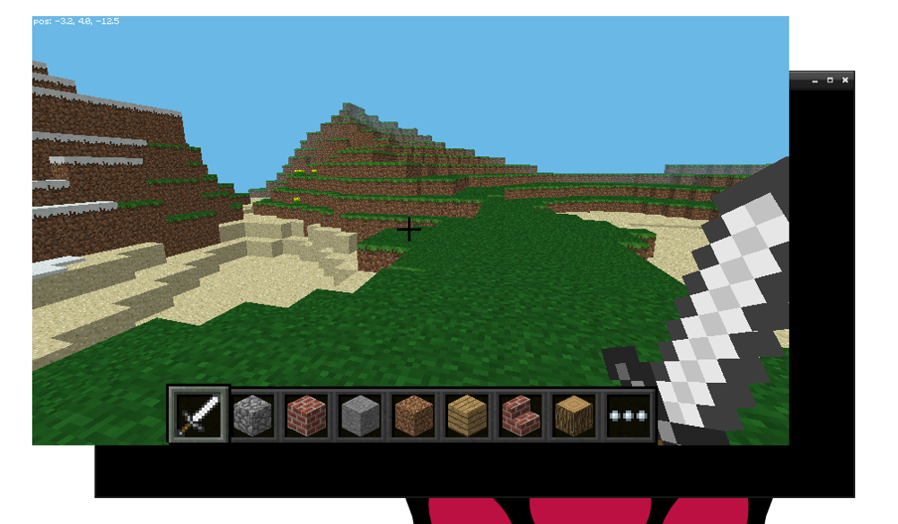
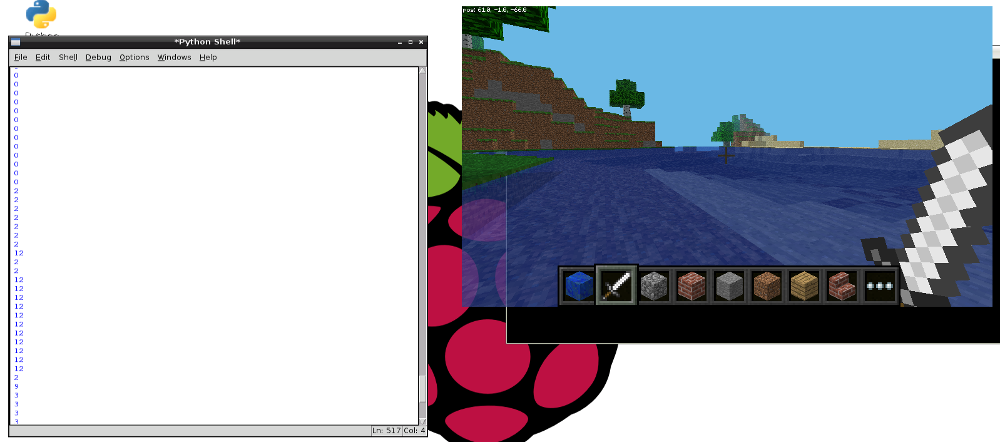
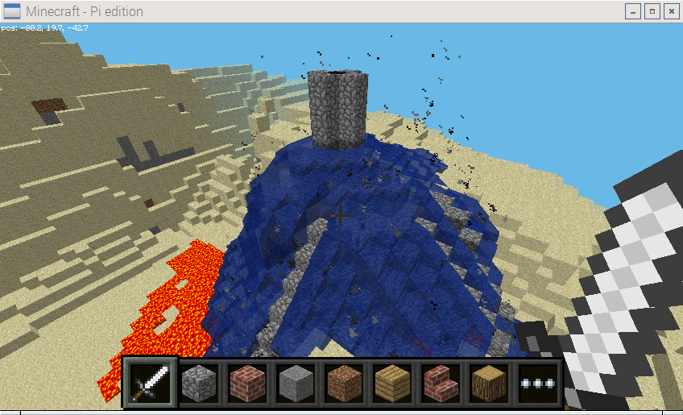

# Getting Started with Minecraft Pi

Minecraft is a popular sandbox open-world building game. A free version of Minecraft is available for the Raspberry Pi; it also comes with a programming interface. This means you can write commands and scripts in Python code to build things in the game automatically. It's a great way to learn Python!


## Run Minecraft

To run Minecraft Pi, open it from the desktop menu or type `minecraft-pi` in the terminal.


When Minecraft Pi has loaded, click on **Start Game**, followed by **Create new**. You'll notice that the containing window is offset slightly. This means to drag the window around you have to grab the title bar behind the Minecraft window.



You are now in a game of Minecraft! Go walk around, hack things, and build things!

Use the mouse to look around and use the following keys on the keyboard:

| Key          | Action               |
| :---:        | :-----:              |
| W            | Forward              |
| A            | Left                 |
| S            | Backward             |
| D            | Right                |
| E            | Inventory            |
| Space        | Jump                 |
| Double Space | Fly / Fall           |
| Esc          | Pause / Game menu    |
| Tab          | Release mouse cursor |

You can select an item from the quick draw panel with the mouse's scroll wheel (or use the numbers on your keyboard), or press `E` and select something from the inventory.


You can also double tap the space bar to fly into the air. You'll stop flying when you release the space bar, and if you double tap it again you'll fall back to the ground.


With the sword in your hand, you can click on blocks in front of you to remove them (or to dig). With a block in your hand, you can use right click to place that block in front of you, or left click to remove a block.

## Use the Python programming interface

With Minecraft running, and the world created, bring your focus away from the game by pressing the `Tab` key, which will free your mouse. Open Python 3 from the application menu and move the windows so they're side-by-side.

You can either type commands directly into the Python window or create a file so you can save your code and run it again another time.

If you want create a file, go to `File > New window` and `File > Save`. You'll probably want to save this in your home folder or a new project folder.

Start by importing the Minecraft library, creating a connection to the game and testing it by posting the message "Hello world" to the screen:

```python
from mcpi.minecraft import Minecraft

mc = Minecraft.create()

mc.postToChat("Hello world")
```

If you're entering commands directly into the Python window, just hit `Enter` after each line. If it's a file, save with `Ctrl + S` and run with `F5`. When your code runs, you should see your message on screen in the game.


### Find your location

To find your location, type:

```python
pos = mc.player.getPos()
```

`pos` now contains your location; access each part of the set of coordinates with `pos.x`, `pos.y` and `pos.z`.

Alternatively, a nice way to get the coordinates into separate variables is to use Python's unpacking technique:

```python
x, y, z = mc.player.getPos()
```

Now `x`, `y`, and `z` contain each part of your position coordinates. `x` and `z` are the walking directions (forward/back and left/right) and `y` is up/down.

Note that `getPos()` returns the location of the player at the time, and if you move position you have to call the function again or use the stored location.

### Teleport

As well as finding out your current location you can specify a particular location to teleport to.

```python
x, y, z = mc.player.getPos()
mc.player.setPos(x, y+100, z)
```

This will transport your player to 100 spaces in the air. This will mean you'll teleport to the middle of the sky and fall straight back down to where you started.

Try teleporting to somewhere else!

### Set block

You can place a single block at a given set of coordinates with `mc.setBlock()`:

```python
x, y, z = mc.player.getPos()
mc.setBlock(x+1, y, z, 1)
```

Now a stone block should appear beside where you're standing. If it's not immediately in front of you it may be beside or behind you. Return to the Minecraft window and use the mouse to spin around on the spot until you see a grey block directly in front of you.


The arguments passed to `set block` are `x`, `y`, `z` and `id`. The `(x, y, z)` refers to the position in the world (we specified one block away from where the player is standing with `x + 1`) and the `id` refers to the type of block we'd like to place. `1` is stone.

Other blocks you can try:

```
Air:   0
Grass: 2
Dirt:  3
```

Now with the block in sight, try changing it to something else:

```python
mc.setBlock(x+1, y, z, 2)
```

You should see the grey stone block change in front of your eyes!


#### Block constants

You can use a inbuilt block constants to set your blocks, if you know their names. You'll need another `import` line first though.

```python
from mcpi import block
```

Now you can write the following to place a block: 

```python
mc.setBlock(x+3, y, z, block.STONE.id)
```

Block ids are pretty easy to guess, just use ALL CAPS, but here are a few examples to get you used to the way they are named.

```
WOOD_PLANKS
WATER_STATIONARY
GOLD_ORE
GOLD_BLOCK
DIAMOND_BLOCK
NETHER_REACTOR_CORE
```

### Block as variable

If you know the id of a block it can be useful to set it as a variable. You can use the name or the integer id.

```python
dirt = 3
mc.setBlock(x, y, z, dirt)
```

or

```python
dirt = block.DIRT.id
mc.setBlock(x, y, z, dirt)
```

### Special blocks

There are some blocks which have extra properties, such as Wool which has an extra setting you can specify the colour. To set this use the optional fourth parameter in `setBlock`:

```python
wool = 35
mc.setBlock(x, y, z, wool, 1)
```

Here the fourth parameter `1` sets the wool colour to orange. Without the fourth parameter it is set to the default (`0`) which is white. Some more colours are:

```
2: Magenta
3: Light Blue
4: Yellow
```

Try some more numbers and watch the block change!

Other blocks which have extra properties are wood (`17`): oak, spruce, birch, etc; tall grass (`31`): shrub, grass, fern; torch (`50`): pointing east, west, north, south; and more. See the [API reference](http://www.stuffaboutcode.com/p/minecraft-api-reference.html) for full details.

### Set multiple blocks

As well as setting a single block with `setBlock` you can fill in a volume of space in one go with `setBlocks`:

```python
stone = 1
x, y, z = mc.player.getPos()
mc.setBlocks(x+1, y+1, z+1, x+11, y+11, z+11, stone)
```

This will fill in a 10 x 10 x 10 cube of solid stone.


You can create bigger volumes with the `setBlocks` function but it may take longer to generate!

## Dropping blocks as you walk

Now you know how to drop blocks, let's use our moving location to drop blocks when you walk.

The following code will drop a flower behind you wherever you walk:

```python
from mcpi.minecraft import Minecraft
from time import sleep

mc = Minecraft.create()

flower = 38

while True:
    x, y, z = mc.player.getPos()
    mc.setBlock(x, y, z, flower)
    sleep(0.1)
```

Now walk forward for a while and turn around to see the flowers you have left behind you.


Since we used a `while True` loop this will go on forever. To stop it, hit `Ctrl + C` in the Python window.

Try flying through the air and see the flowers you leave in the sky:


What if we only wanted to drop flowers when the player walks on grass? We can use `getBlock` to find out what type a block is:

```python
x, y, z = mc.player.getPos()  # player position (x, y, z)
this_block = mc.getBlock(x, y, z)  # block ID
print(this_block)
```

This tells you the location of the block you're standing *in* (this will be `0` - an air block). We want to know what type of block we're standing *on*. For this we subtract 1 from the `y` value and use `getBlock()` to determine what type of block we're standing on:

```python
x, y, z = mc.player.getPos()  # player position (x, y, z)
block_beneath = mc.getBlock(x, y-1, z)  # block ID
print(block_beneath)
```

This tells us the ID of the block the player is standing on.

Test this out by running a loop to print the block ID of whatever you're currently standing on:

```python
while True:
    x, y, z = mc.player.getPos()
    block_beneath = mc.getBlock(x, y-1, z)
    print(block_beneath)
```



We can use an `if` statement to choose whether or not we plant a flower:

```python
grass = 2
flower = 38

while True:
    x, y, z = mc.player.getPos()  # player position (x, y, z)
    block_beneath = mc.getBlock(x, y-1, z)  # block ID

    if block_beneath == grass:
        mc.setBlock(x, y, z, flower)
    sleep(0.1)
```

Perhaps next we could turn the tile we're standing on into grass if it isn't grass already:

```python
if block_beneath == grass:
    mc.setBlock(x, y, z, flower)
else:
    mc.setBlock(x, y-1, z, grass)
```

Now we can walk forward and if we walk on grass, we'll leave a flower behind. If the next block is not grass, it turns into grass. When we turn around and walk back, we now leave a flower behind us.


## Playing with TNT blocks

Another interesting block is TNT! To place a normal TNT block use:

```python
tnt = 46
mc.setBlock(x, y, z, tnt)
```


However, this TNT block is fairly boring. Try applying `data` as `1`:

```python
tnt = 46
mc.setBlock(x, y, z, tnt, 1)
```

Now use your sword and left click the TNT block: it will be activated and will explode in a matter of seconds!

Now try making a big cube of TNT blocks!

```python
tnt = 46
mc.setBlocks(x+1, y+1, z+1, x+11, y+11, z+11, tnt, 1)
```


Now you'll see a big cube full of TNT blocks. Go and activate one of the blocks and then run away to watch the show! It'll be really slow to render the graphics as so many things are changing at once.


## Fun with flowing lava.

One block that's a lot of fun to play with is flowing lava.

```python
from mcpi.minecraft import Minecraft

mc = Minecraft.create()

x, y, z = mc.player.getPos()

lava = 10

mc.setBlock(x+3, y+3, z, lava)
```

Find the block you've just placed, and you should see lava flowing from the block to the ground.

The cool thing about lava is that when it cools down it becomes rock. Move to another location in your world and try this:

```python
from mcpi.minecraft import Minecraft
from time import sleep

mc = Minecraft.create()

x, y, z = mc.player.getPos()

lava = 10
water = 8
air = 0

mc.setBlock(x+3, y+3, z, lava)
sleep(20)
mc.setBlock(x+3,y+5, z, water)
sleep(4)
mc.setBlock(x+3, y+5, z, air)

```

You can adjust the `sleep` parameters to allow more or less lava to flow.



## What next?

There's plenty you can do now you know your way around the Minecraft world and how to use the Python interface.

### Networked game

If multiple people connect Raspberry Pis to a local network, they can join the same Minecraft world and play together. Players can see each other in the Minecraft world.

### API reference

For a more extensive documentation of functions and a full list of block IDs see an API reference at [stuffaboutcode.com](http://www.stuffaboutcode.com/p/minecraft-api-reference.html).

### Make a game

Try out another resource and make a Whac-a-mole game: [Minecraft Whac-a-Block](https://www.raspberrypi.org/learning/minecraft-whac-a-block-game/).
